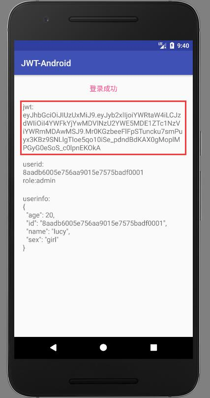

# JWT Android端

## 使用[JWT](https://jwt.io/)(JSON Web Token)做无状态的API身份认证

声明两个接口：

```java
@POST("login")
@FormUrlEncoded
Call<BaseModel<String>> login(@Field("name") String name,
                              @Field("pwd") String pwd);

@GET("user")
Call<BaseModel<User>> getUser(@Header("jwt") String token);
```

+ 登录接口提交用户名密码，服务端返回jwt令牌：



+ 客户端将token放在请求头，服务端校验通过即返回用户信息

+ 客户端在本地存储token以后就能免登陆

## 服务端代码：

https://github.com/yunTerry/JWT-Server